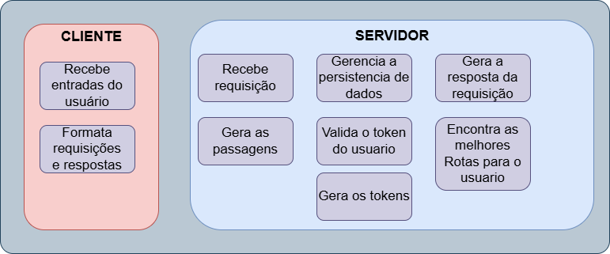
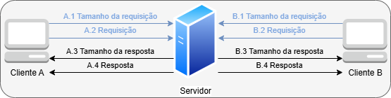
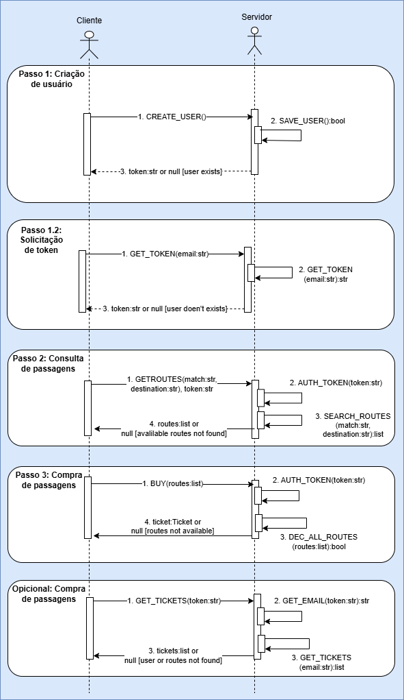
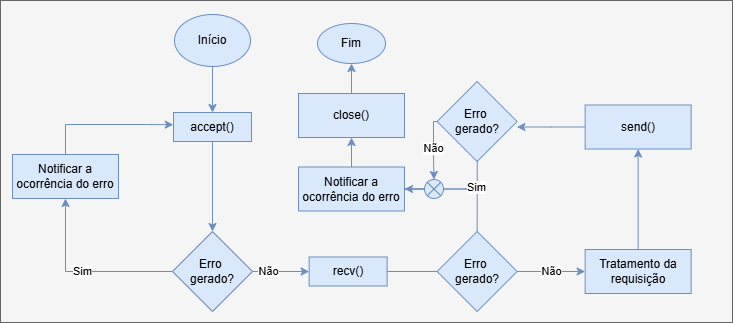
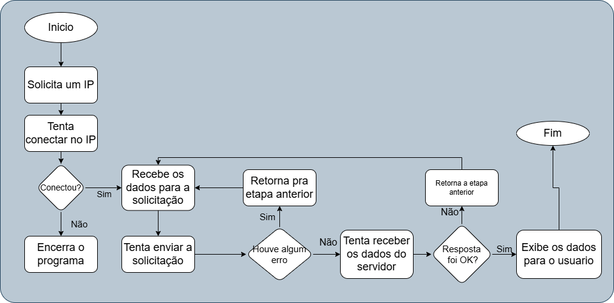

<h3 align="center">VendePass</h3>

Sistema de venda de passagens aéreas impleentado com o protocolo TCP/IP e API Socket.

# Introdução

Este trabalho tem como objetivo descrever as ideias e decisões tomadas durante o desenvolvimento de um sistema de venda de passagens aéreas. O sistema deve adotar o modelo cliente-servidor e, por conta de direitos de uso e licenças, deve utilizar somente a API básica Socket. A solução deve deve, ainda, permitir a compra simultânea de passagens, assim como permitir que o usuário escolha os trechos que desejar.

O sistema desenvolvido conseguiu atender a todos os requisitos solicitados, apresentando um desempenho ótimo nos testes, além de implementar ferramentas que facilitam o desenvolvimento e continuidade da implementação por terceiros. 

# Metodologia

## Arquitetura do sistema

A arquitetura do sistema desenvolvido segue o modelo cliente-servidor. O servidor disponibiliza uma conexão por meio da qual o cliente pode enviar requisições e obter respostas. O tipo de resposta varia de acordo com o método invocado, assim como com os parâmetros passados. 

A arquitetura foi desenvolvida tomando como base o padrão Hypertext Transfer Protocol (HTTP) de interfaces de programação de aplicativos (APIs) Representational State Transfer (REST) em sua abordagem RESTful. Nestes padrões, uma solicitação é enviada mediante a uma conexão e, após isso, o servidor retorna os dados e o status da solicitação (bem-sucedida, houve erro dentre outros) (ROSENBLUM, 2008). 

A solução é composta por dois tipos de entidades: o servidor e os clientes. O servidor dispõe de um conjunto pré-definido de solicitações que o cliente pode realizar: cadastro, login, busca de passagens e de bilhetes, e compra de passagens. Esta entidade é responsável pelo recebimento e processamento de requisições,  gerenciamento dos arquivos de persistência de dados  e envio de respostas aos clientes.

O cliente é responsável por receber as entradas do usuário, formatá-las em um modelo de requisição válida, enviá-las ao servidor e, após, receber e processar as respostas e exibi-las ao usuário.

A fim de facilitar a comunicação com o servidor, desenvolveu-se uma pseudo biblioteca com um conjunto de funções que simplificam a realização de requisições e o tratamento de respostas e possíveis erros de conexão. Figura 1 ilustra as entidades do sistema, assim como suas respectivas competências.

  <figure>  
    
    <figcaption>
      
 

**Figura 1:** Entidades do sistema e suas competências

    </figcaption>
  </figure>

## Paradigma de Comunicação 

A solução foi desenvolvida com base no paradigma stateless,  um modelo simples que permite uma fácil integração do sistema com diferentes linguagens de programação. Além disso, este paradigma é mais facilmente administrado pelo servidor, já que o servidor não armazena informações sobre as conexões dos clientes dentre outras informações de estado (RED HAT, 2023). 

Uma das principais vantagens do modelo stateless é a alta escalabilidade. Ao não exigir o armazenamento de dados de estado entre solicitações, permite que um mesmo cliente possa ser atendido por diferentes servidores sem que sofra perda de dados ou necessidade de sincronização entre servidores (RED HAT, 2023).

Outra vantagem do stateless é que as requisições e respostas podem ser atendidas mais rapidamente uma vez que não se é necessário validações extras sobre determinado IP ou conexão, ou sobre os estados associados a essa conexão. É necessário apenas verificar a existência e autenticidade do token e prosseguir com o processamento da solicitação. Essa característica permite que o servidor atenda a uma grande quantidade de solicitações, ou seja, alto throughput (RED HAT, 2023).

No sistema desenvolvido, as requisições ao servidor são acompanhadas de um token, o qual é autenticado antes da execução do serviço. O token é gerado a partir do email do cliente durante o cadastro e pode ser solicitado por meio do processo de login.

## Protocolo de comunicação

A  arquitetura de comunicação da aplicação foi implementada utilizando o conjunto de protocolos Transmission Control Protocol/ Internet Protocol Suite (TCP/IP), que podem ser aplicados a qualquer estrutura de rede (simples ou complexas). A implementação prática da arquitetura deu-se por meio da API Socket, que possibilita a comunicação entre processos tanto localmente como remotamente.(MARUYAMA, 
2023; USP, 2023\)

Para assegurar a confiabilidade e robustez na comunicação entre cliente e servidor, optou-se pelo serviço stream socket (da API Socket), o qual implementa o TCP. O TCP estabelece uma conexão entre a origem e o destino, garantindo a ordem e integridade dos dados (MARUYAMA, 2023). Como protocolo de endereçamento, foi utilizado o IPv4.  

A comunicação entre cliente e servidor foi padronizada de forma que cada solicitação feita pelo cliente obrigatoriamente receba uma resposta do servidor. Além disso, para facilitar o processamento das mensagens pelos nós, tanto as requisições quanto as respostas são precedidas por uma mensagem contendo seu tamanho em caracteres. Esta mensagem possui o tamanho fixo de 64 caracteres. Figura 2 ilustra a comunicação em pares estabelecida.  

  <figure>  
    
    <figcaption>
      
 

**Figura 2:** Requisições e respostas  

    </figcaption>
  </figure>

As mensagens de requisição possuem três campos: i) tipo:  informa ao servidor qual o serviço desejado, além de especificar o formato dos dados que estão sendo enviados; ii) dado: contém os dados da requisição; iii) token: armazena a chave a ser usada na autenticação do cliente.   

As mensagens do tipo resposta também possuem três campos: i) status: indica a condição da solicitação; ii) dado: resultado da solicitação; iii) tipo: indica o tipo de dado no campo dado.  
Figura 3 ilustra o fluxo de comunicação entre as entidades durante o processo de compra de passagens, caso mais complexo do sistema.

  <figure>  
    
    <figcaption>
      
 

**Figura 3:** Protocolo de requisições e respostas  

    </figcaption>
  </figure>

## Dados: formatação e tratamento

As mensagens trocadas entre cliente e servidor adotaram o formato JavaScript Object Notation (JSON). O JSON, um formato baseado em texto comumente utilizado para o armazenamento e transmissão de informações, oferece estrutura compacta, o que acelera a análise dos dados. Além disso, sua independência em relação às linguagens de programação, proporcionada pela utilização das convenções compartilhadas por várias linguagens (tais como Python, C++, Java e Perl), torna o JSON ideal para a comunicação de dados.(MDN, s.d.; PROCEDEBAHIA, s.d.)

Neste projeto, adotou-se duas representações distintas do formato JSON para as requisições e as respostas. As requisições possuem os rótulos type (tipo de requisição), data (parâmetro da requisição) e token (chave de autenticação do cliente). Por sua vez, as respostas possuem os rótulos: status (status da solicitação), data (dados retornados) e type (tipo de dado retornado)

Quadro 1 e Quadro 2 detalham os valores pré-definidos que os campos das requisições e respostas podem assumir, respectivamente. O campo token recebe uma string (vazia nos casos das requisições “GETTOKEN” e “CREATEUSER” 

| Tipo de requisição | Dado |
| :---: | ----- |
| “GETTOKEN” | None |
| “CREATEUSER” | email: string |
| “GETROUTES” | {“match”: origem(string), “destination”: destino (string)} |
| “BUY” | \[(origem1:string, origem2:string), … , (origemN (string), destinoN (string)\] |
| “GETTICKETS” | None |

**Quadro 1:** Valores pré-definidos para os campos das mensagens de requisição  
.

| Tipo de serviço | Status | Dado | Tipo |
| :---: | :---: | ----- | :---: |
|  “GETTOKEN” | 100 | String | “TOKEN” |
|  | 220 | NONE | “NONE” |
|  “CREATEUSER” | 100 | String | “TOKEN” |
|  | 240 | NONE | “NONE” |
|  “GETROUTES” | 100 | \[{‘match’: match1 (string),’destination’: destination1 (string),’sits’: sits1(int), ‘id’: id1(string} … , {‘match’: matchN (string),’destination’: destinationN (string),’sits’: sitsN(int), ‘id’: idN(string}\] | “ROUTE” |
|  | 220 | None | “NONE” |
|  | 260 | None | “NONE” |
| “BUY” | 100 | {‘email’: email(string), ‘timestamp’: time(string), ‘routes’:\[(match1:string, destination1:string), … , (matchN:string, destinationN:string\]} |  |
|  | 220 | None | “NONE” |
|  | 260 | None | “NONE” |
| “GETTICKETS” | 100 | {{‘email’: email1(string), ‘timestamp’: time1(string), ‘routes’:\[(match11:string, destination11:string), … , (matchN1:string, destinationN1:string\]}, … , {‘email’: emailn(string), ‘timestamp’: timen(string), ‘routes’:\[(match1n:string, destination1:string), … , (matchNn:string, destinationNn:string\]}} | “TICKET” |
|  | 220 | None | “NONE” |
|  | 260 | None | “NONE” |

**Quadro 2:** Valores pré-definidos para os campos das mensagens de resposta

## Conexões simultaneas e concorrência

A fim de viabilizar a solicitação de requisições de forma simultânea, implementou-se um executor de threads (ThreadPoolExecutor) com dez threads. Esta técnica permite a execução concorrente das múltiplas requisições recebidas pelo servidor, garantindo uma resposta rápida e eficiente ao cliente, mesmo em períodos de alta demanda. 

A otimização do paralelismo do servidor pode ser realizada por meio da experimentação com executores com diferentes números de threads. O objetivo é encontrar um equilíbrio entre o tempo de resposta e o custo computacional do servidor. 

A execução das requisições de forma concorrente envolve o compartilhamento de arquivos e variáveis que armazenam informações sobre usuários, passagens e bilhetes emitidos. O acesso e alteração simultâneos destes recursos podem ocasionar problemas de concorrência tal como a inconsistência de dados. A fim de garantir a integridade das informações e a confiabilidade do sistema, implementou-se mecanismos de exclusão mútua (mutexes) para controlar o acesso a estes recursos distribuídos.  

No total, foram implementados seis mutexes, um para cada recurso: backlog de clientes, arquivo de usuários, arquivo de bilhetes, lista de adjacência do grafo de rotas, dicionário de rotas e matriz esparsa de adjacência.  A definição das regiões críticas levou em consideração a necessidade de atomicidade para a execução da tarefa, a frequência de utilização do recurso compartilhado e o tempo de acesso ao recurso. Quadro 3 lista as tarefas e os respectivos recursos acessados.

| Tarefa | Recursos | Operação | Atomicidade |
| :---- | :---- | :---- | :---- |
| Autenticação de cliente | Arquivo de usuários | Leitura | Não |
| Criação de usuário | Arquivo de usuários | Escrita | Não |
| Consulta de rotas | Matriz de adjacência e dicionário de rotas | Leitura | Não |
| Registro de compra | Dicionário de rotas e, no pior caso, matriz de adjacência e lista de adjacência | Escrita | Sim |
| Geração de bilhete | Arquivo de usuários e arquivo de bilhetes | Leitura e escrita, respectivamente | Não |
| Consulta de bilhetes | Arquivo de bilhetes | Leitura | Não |

**Quadro 3:** Tarefas executadas e os respectivos recursos acessados

## Confiabilidade do sistema

Visando assegurar a confiabilidade da solução, foram desenvolvidas rotinas de tratamento de erros e exceções durante a conexão entre o cliente e o servidor. 

No servidor, as rotinas de tratamento foram implementadas tanto no estabelecimento de uma nova conexão como no recebimento e envio de mensagens. Na detecção de erros, uma notificação é gerada e, nos casos em que a troca de informações é comprometida, a conexão com o cliente é encerrada. Figura 3 detalha o fluxo genérico de execução de requisições considerando os possíveis erros de conexão.   

Já no lado do cliente, as rotinas de tratamento foram implementadas de modo que seja possível continuar uma operação mesmo que haja falha na rede, com exceção da desativação do servidor, onde neste caso o programa redireciona o cliente para digitar um novo IP ou encerrar seu acesso. Figura 4 detalha o fluxo genérico da execução do sistema cliente  

  <figure>  
    
    <figcaption>
      
 

**Figura 3:** Fluxo genérico de uma requisição ao servidor com tratamento de erros

    </figcaption>
  </figure>

 

  <figure>  
    
    <figcaption>
      
 

**Figura 4:** Fluxo genérico de uma requisição do cliente com tratamento de erros

    </figcaption>
  </figure>

 
 

## Portabilidade e documentação 

Os containers dockers foram utilizados para aumentar a portabilidade do sistema, permitindo sua execução a partir de qualquer máquina com o Docker instalado. Esta abordagem reduz incompatibilidades e a necessidade de configurações adicionais para seu bom funcionamento.

O cliente e o servidor foram separados em dois Dockerfiles distintos. Desta forma, as dependências específicas de cada entidade puderam ser instaladas separadamente. Consequentemente, são necessários, ao menos, dois containers para executar a aplicação completa, um para cada Dockerfile.

Ambos os containers utilizam a versão da linguagem de programação Python 3.12 que foi a versão em que o sistema foi desenvolvido.

A documentação do projeto seguiu a sintaxe da ferramenta de documentação de projetos Doxygen, apesar de não utilizá-la. Para acessar a documentação, basta utilizar o comando pydoc.

# Resultados e discussões

## Desempenho e avaliação

Como métrica de desempenho, foram realizados experimentos com diferentes implementações para a melhora no desempenho geral do sistema. Na primeira, o servidor tratou uma requisição de cada vez, sem o auxílio de qualquer multiprocessamento ou técnica semelhante. Na segunda o servidor criou threads infinitas, uma para cada solicitação. Por fim, na terceira implementou-se uma threadpool com 10 threads,as quais revezaram-se para atender as requisições dos clientes.

A comparação de desempenho das três implementações, foi realizada simulando 200 clientes comprando passagens simultaneamente (em uma mesma rede). O algoritmo que obteve melhor desempenho foi o de threadpool com um tempo aproximado de 0.5 segundos. Este resultado deve-se ao fato de que nesse tipo de algoritmo os recursos computacionais conseguem ser melhor administrados pelo sistema operacional.

Em segundo lugar ficou o algoritmo que permitia a criação infinitas de threads levando cerca de um segundo para atender a todas as solicitações, 50% pior que o primeiro colocado. Já o algoritmo base e que não implementou nenhuma técnica de distribuição das requisições teve um tempo aproximado entre 2 e 3 segundos, variando a depender do hardware utilizado. Esse algoritmo mais simples foi usado como base para as aferições e comparação de desempenho entre os outros 2 algoritmos.

Ao observar os resultados, ficou evidente que o algoritmo de thread pool era superior e assim, foi implementado na solução final, tornando o servidor mais rápido e eficaz para atender as solicitações e requisições em um tempo hábil e desejável.

## Confiabilidade

# Conclusões

O presente trabalho buscou implementar um sistema de venda de passagens aéreas utilizando o modelo cliente-servidor associado ao conjunto de padrões TCP/IP. A solução utilizou a API Socket na implementação da comunicação entre clientes e servidor, aplicando o protocolo de transporte TCP e o protocolo de endereçamento IPv4.  

O servidor desenvolvido implementa  o paradigma stateless e provê aos clientes métodos para a compra de passagens, busca de informações e cadastro. A comunicação entre as entidades é realizada por meio do protocolo desenvolvido baseado no modelo HTTP das APIs RESTful. A troca de mensagens é realizada utilizando o formato JSON. A fim de garantir a simultaneidade do processamento das requisições, implementou-se uma threadpool com 10 threads e mutexes para gerenciar o acesso aos recursos compartilhados.

A solução compriu com todos os requisitos, atingindo a um desempenho satisfatório e uma alta confiabilidade. Para trabalhos futuros, sugere-se a implementação de um banco de dados para a persistência das informações. E um sistema mais complexo de autenticação de clientes. 

# Referências

RED HAT. Stateful x stateless:  Entendendo a diferença entre aplicativos nativos em nuvem. 07 de ago. 2023\. Disponível em: \<[https://www.redhat.com/pt-br/topics/cloud-native-apps/stateful-vs-stateless](https://www.redhat.com/pt-br/topics/cloud-native-apps/stateful-vs-stateless)\> Acesso em: 24 ago. 2024\.

MDN (mozilla.org). Trabalhando com JSON \- Aprendendo desenvolvimento web.\[s.d\] Disponível em: [https://developer.mozilla.org/pt-BR/docs/Learn/JavaScript/Objects/JSON](https://developer.mozilla.org/pt-BR/docs/Learn/JavaScript/Objects/JSON). Acesso em: 24 set. 2024\.

USP.Curso de TCP/IP. São Paulo: Universidade de São Paulo, 2024\. Disponível em: https://www.lsi.usp.br/\~leo/curso/tcp\_ip.pdf. Acesso em: 24 set. 2024\.

MARUYAMA, Newton.UNIVERSIDADE DE SÃO PAULO. Aula 05 \- Socket API e Introdução às Aplicações TCP/IP. São Paulo: USP, 2023\. Disponível em: https://edisciplinas.usp.br/pluginfile.php/7978757/mod\_resource/content/1/PMR341Aula05V2023.pdf. Acesso em: 24 set. 2024\.  
PROCEDEBAHIA. Manual JSON. Disponível em: https://www.procedebahia.com.br/manual\_json.pdf.\[s.d\] Acesso em: 22 set. 2024

Rosenblum, M. (2008). CS142 Lecture Notes \- HTTP. Disponível em:[https://web.stanford.edu/class/cs142/lectures/HTTP.pdf](https://web.stanford.edu/class/cs142/lectures/HTTP.pdf). Acesso em: 22\. set. 2024